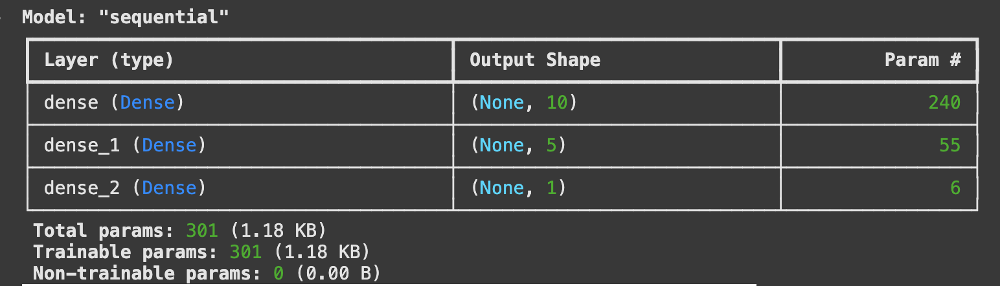
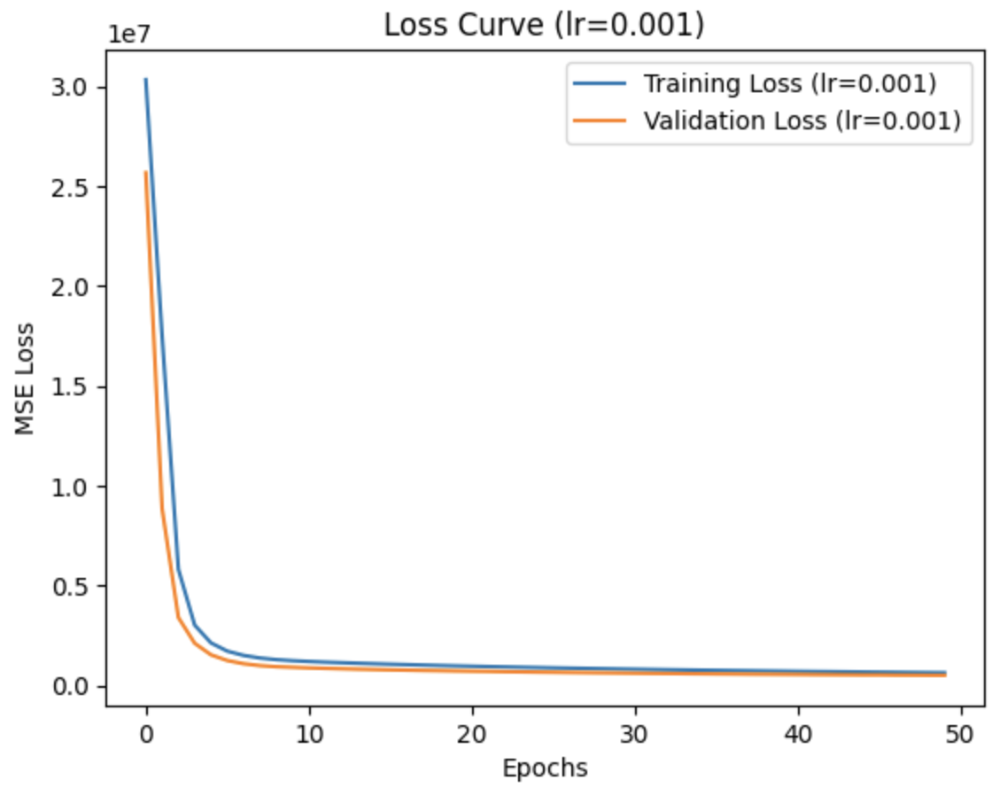
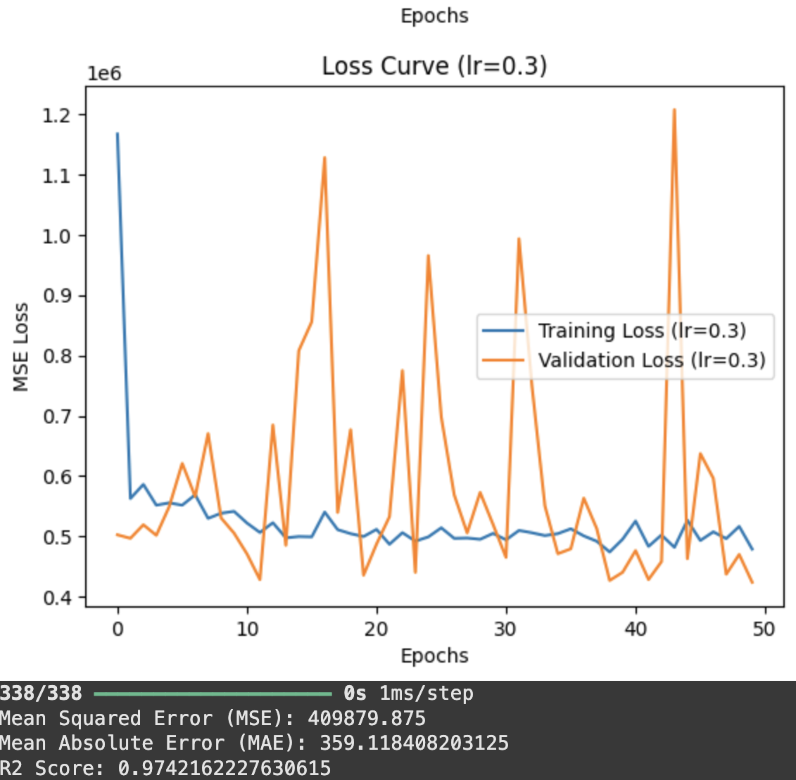
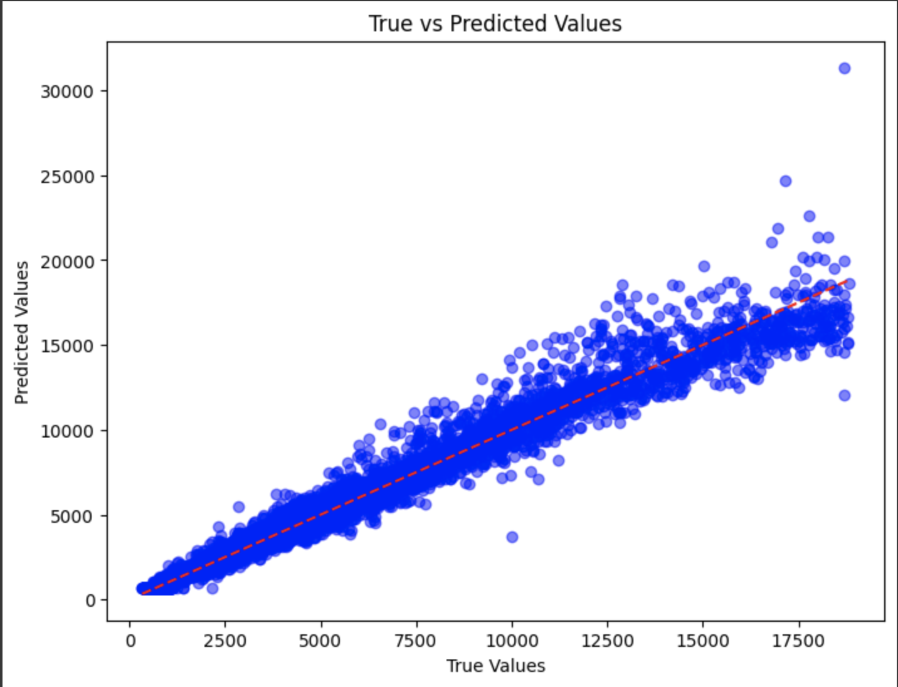

#  Diamonds Price Prediction using Neural Networks  

A **Feedforward Neural Network (FNN)** trained on the **Diamonds dataset** to predict **diamond prices** based on their attributes. The model is evaluated using different learning rates (`0.001` vs `0.3`) to observe their effects.

---

##  Features  
- 🔹 **Data Preprocessing**  
  - One-hot encoding for categorical features  
  - Standardization using `StandardScaler`  
- 🔹 **Neural Network Model**  
  - Built with **TensorFlow/Keras**  
  - **Two hidden layers** (10 and 5 neurons)  
  - **ReLU activation function**  
- 🔹 **Training & Optimization**  
  - **Adam Optimizer** with different **learning rates** (`0.001` and `0.3`)  
  - **50 epochs** per training run  
- 🔹 **Model Evaluation**  
  - **Loss Curve Analysis** for different learning rates  
  - **Mean Squared Error (MSE), Mean Absolute Error (MAE), R² Score**  
  - **Scatter plot** to compare actual vs. predicted prices  

---

## Screenshots  

### **🔹 Model Architecture**


### **🔹 Loss Curve (lr=0.001)**


### **🔹 Loss Curve (lr=0.3)**


### **🔹 True vs Predicted Prices**


---

## 📂 Dataset  
The **Diamonds dataset** is loaded directly from **Seaborn**. It contains various attributes of diamonds such as:  
📌 **Features:** `carat, cut, color, clarity, depth, table, x, y, z`  
📌 **Target Variable:** `price`  

All categorical features are encoded using **one-hot encoding**, and numerical features are **standardized**.

---

## 🛠️ Technologies & Libraries  

| Library  | Purpose |
|----------|---------|
| `numpy, pandas`  | Data handling |
| `matplotlib, seaborn` | Data visualization |
| `sklearn.model_selection` | Train-test split |
| `sklearn.preprocessing` | Feature scaling |
| `sklearn.metrics` | Model evaluation (MSE, MAE, R²) |
| `tensorflow.keras` | Neural Network (FNN) |

### 🏗️ Built With  
-   
-   
-   
-   

---

## 🎯 How to Run  

### 1️⃣ Clone the repository  
```bash
git clone https://github.com/your-username/diamonds-price-prediction.git
cd diamonds-price-prediction
```

### 2️⃣ Install dependencies
```bash
pip install numpy pandas seaborn tensorflow scikit-learn matplotlib
```

### 3️⃣ Run the Python script
```bash
python NNproject.py
```

## 📊 Model Evaluation  

| Learning Rate | Training Loss (MSE) | Validation Loss (MSE) | Test MSE | Test MAE | R² Score |
|--------------|------------------|------------------|--------|--------|----------|
| **0.001**    | Low & Stable    | Low & Stable    | Good Performance | Low | **High R²** |
| **0.3**      | High Variability | Unstable | Poor Performance | High | **Low R²** |

✔ **Best Learning Rate:** **0.001** → More stable training, lower loss, and better predictions.

---

## in the end  
- **Lower learning rate (0.001) leads to better performance and stable convergence.**  
- **Higher learning rate (0.3) results in unstable training and poor generalization.**  
- **Neural Networks are effective for regression tasks, but hyperparameter tuning is crucial!**  

